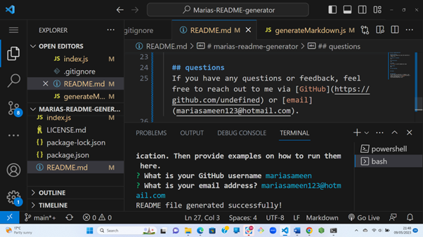

# Marias-README-generator

## Description
This is a command-line application that allows users to generate a professional README.md file for their GitHub project. The application pronpts users to answer a series of questions about their project.

## Usage
   
    

    

    

    
    

## License

This app uses an MIT license

